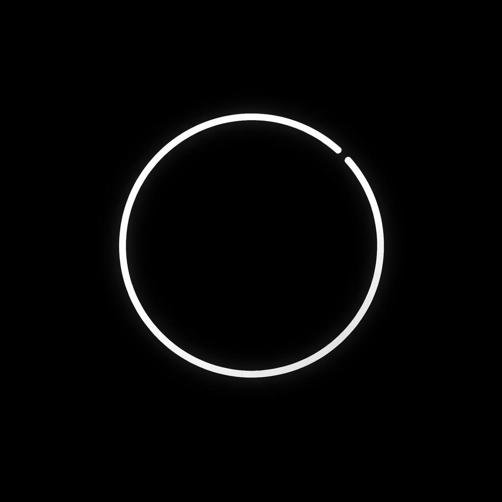

<p align="center">
  
</p>

<h1 align="center">PACE — Documentation</h1>

---

## Introduction

PACE is a minimal fullscreen productivity timer for Windows. It compiles to a single ~5 MB static executable with zero runtime dependencies — no DLLs, no installers, no config files required. Fonts and sounds are embedded directly in the binary.

The design philosophy prioritizes calm, focused aesthetics: a pure black background, crisp white Inter typography, and smooth GPU-accelerated rendering at 60 FPS. Every visual detail — from digit transitions to blink patterns — is intentional.

---

## App Concept

PACE is built around one idea: **remove everything that isn't the timer.**

When you launch PACE, the screen goes black and a single set of digits appears. There is no title bar, no menu, no toolbar. You press Space to start and the timer counts down. When it finishes, a soft bell plays. That's it.

The app supports three workflows:

- **Countdown** — Set a fixed duration (25m, 50m, or custom) and focus until it hits zero.
- **Pomodoro** — Automatically cycle through focus and break intervals with session tracking.
- **Stopwatch** — Count up indefinitely for open-ended work sessions.

All settings are adjustable in real-time through an in-app settings panel (TAB), so you never leave the timer.

---

## How the Timer Works

### Clock Independence

The timer uses `time.Now()` and `time.Since()` for nanosecond-resolution wall-clock timing. It never counts frames or relies on a fixed tick rate.

```
Start:  startTime = time.Now()
Update: elapsed = time.Since(startTime)
Pause:  pausedAt = elapsed
Resume: startTime = time.Now() - pausedAt
```

This means the timer remains accurate regardless of frame rate drops or system load.

### Timer Modes

| Mode      | Behavior                                       |
|-----------|-------------------------------------------------|
| Countdown | Counts down from a set duration to zero          |
| Pomodoro  | Countdown with automatic phase-based cycling     |
| Stopwatch | Counts up indefinitely from zero                 |

### Pomodoro Cycle

The default cycle follows the classic Pomodoro pattern:

```
[Focus 25m] → [Short Break 5m] → [Focus 25m] → [Short Break 5m] →
[Focus 25m] → [Short Break 5m] → [Focus 25m] → [Long Break 20m] → repeat
```

State transitions:

```
PhaseFocus ──complete──► PhaseShortBreak  (if session < total)
PhaseFocus ──complete──► PhaseLongBreak   (if session >= total)
PhaseShortBreak ──complete──► PhaseFocus  (session++)
PhaseLongBreak  ──complete──► PhaseFocus  (session = 1)
```

Transitions are user-initiated — press Space after a phase completes to advance.

---

## UI Explanation

### Layout

The interface is a layered fullscreen composition rendered in strict order:

1. **Background** — Full black clear (or frame persistence fade)
2. **Progress ring** — Thin circular arc behind all text
3. **Mode indicator** — Subtle label at the top edge
4. **Task label** — Phase name or custom task above the timer
5. **Timer digits** — Large MM:SS display, vertically centered
6. **Session info** — Session count and accumulated focus time
7. **Keyboard hints** — Faint shortcut reminders at the bottom
8. **Overlays** — Settings panel or sound selector (always on top)

### Timer Text Stability

Timer digits are rendered in **fixed-width character cells**. The widest digit (0–9) is measured at startup and every character is drawn centered within a cell of that width. This prevents horizontal jitter when digits change (e.g., "1" vs "0").

### Color Palette

| Name       | Hex     | Usage                          |
|------------|---------|--------------------------------|
| Background | #000000 | Screen background              |
| Primary    | #FFFFFF | Timer digits, active labels    |
| Secondary  | #8A8A8A | Labels, session info           |
| Subtle     | #333333 | Hints, ring background         |
| Accent     | #50C878 | Progress ring (focus)          |
| Break      | #64A0FF | Progress ring (break)          |
| Complete   | #FFC850 | Progress ring (completed)      |

### Typography

| Weight         | Usage                              |
|----------------|------------------------------------|
| Inter Bold     | Timer digits                       |
| Inter SemiBold | Mode indicator, settings titles    |
| Inter Regular  | Labels, hints, session info        |

Font sizes scale relative to screen height (e.g., timer digits at 14% of height). The timer sits at 45% of screen height, slightly above center, following macOS-style layout conventions.

---

## Keyboard Shortcuts

### Main Controls

| Key           | Action                          |
|---------------|---------------------------------|
| Space         | Start / Pause / Resume          |
| R             | Reset timer                     |
| F             | Toggle fullscreen               |
| TAB           | Open / close settings panel     |
| Ctrl+Space    | Toggle frame persistence mode   |
| P             | Pomodoro mode                   |
| W             | Stopwatch mode                  |
| S             | Sound selector                  |
| 1             | Set 25 minute countdown         |
| 2             | Set 50 minute countdown         |
| 3             | Set 5 minute break              |
| ESC           | Exit                            |

### Settings Panel Navigation

| Key   | Action            |
|-------|-------------------|
| ↑ ↓   | Navigate options  |
| ← →   | Adjust values     |
| TAB   | Close panel       |
| ESC   | Close panel       |

### Input Priority

When overlays are open, they capture all input:

1. Settings panel (highest priority when open)
2. Sound selector
3. Normal shortcut routing

All shortcuts are configurable in `config.json` under the `keys` object.

---

## Configuration Options

A `config.json` file is auto-created next to the executable on first run. All values are also adjustable live through the settings panel (TAB).

### Full Schema

| Field                        | Type    | Default     | Range         |
|------------------------------|---------|-------------|---------------|
| `focus_duration_minutes`     | int     | 25          | 1–120         |
| `short_break_minutes`        | int     | 5           | 1–30          |
| `long_break_minutes`         | int     | 20          | 1–60          |
| `sessions_before_long_break` | int     | 4           | 1–10          |
| `default_timer_minutes`      | int     | 25          | 0+            |
| `sound`                      | string  | "bell"      | bell/chime/none |
| `font_scale`                 | float   | 1.0         | 0.5–3.0       |
| `task_name`                  | string  | "Deep Work" | —             |
| `volume`                     | float   | 0.4         | 0.0–1.0       |
| `show_progress_ring`         | bool    | true        | —             |
| `enable_animations`          | bool    | true        | —             |
| `frame_persistence`          | bool    | false       | —             |
| `keys`                       | object  | (defaults)  | —             |

### Key Binding Format

Each entry in the `keys` object follows this structure:

```json
{
  "key": 32,
  "ctrl": false,
  "name": "Space"
}
```

- `key` — Raylib key code (int32)
- `ctrl` — Whether Ctrl must be held
- `name` — Display name shown in keyboard hints

### Settings Panel Options

| Setting          | Step    | Range       |
|------------------|---------|-------------|
| Focus Duration   | ±5 min  | 1–120 min   |
| Short Break      | ±1 min  | 1–30 min    |
| Long Break       | ±5 min  | 1–60 min    |
| Sessions         | ±1      | 1–10        |
| Sound            | cycle   | bell/chime/none |
| Volume           | ±10%    | 0–100%      |
| Font Scale       | ±0.1    | 0.5–3.0x    |
| Progress Ring    | toggle  | On/Off      |
| Animations       | toggle  | On/Off      |
| Frame Persistence| toggle  | On/Off      |

---

## Technical Architecture

### Technology Stack

| Component   | Technology                      |
|-------------|---------------------------------|
| Language    | Go                              |
| Renderer    | Raylib 5.5 (via raylib-go)      |
| Fonts       | Inter v4.1 (embedded TTF)       |
| Audio       | Procedural WAV generation       |
| Build       | CGO with static linking         |
| Config      | JSON (auto-created at runtime)  |

### Module Layout

| File           | Responsibility                              |
|----------------|---------------------------------------------|
| `main.go`      | Window initialization, render loop          |
| `app.go`       | Central state machine, lifecycle management |
| `timer.go`     | System-clock timer, digit transitions       |
| `pomodoro.go`  | Pomodoro cycle logic                        |
| `renderer.go`  | Layered OpenGL drawing via Raylib           |
| `input.go`     | Configurable keyboard event routing         |
| `sound.go`     | Procedural WAV generation, playback         |
| `fonts.go`     | Embedded TTF loading via `//go:embed`       |
| `ui.go`        | Animation state machine                     |
| `config.go`    | JSON config with key bindings               |

### Data Flow

```
main.go
  └─ creates App
       ├─ Timer       — system time tracking, digit transitions
       ├─ Pomodoro    — cycle state machine
       ├─ Renderer    — layered drawing
       ├─ SoundSystem — generates and plays sounds
       └─ UI          — animation state (blink, scale, fade)

Per frame:
  1. Timer.Update(dt)     — read system clock, advance digit fade
  2. UI.Update(dt, ...)   — advance blink, scale, fade animations
  3. HandleInput()        — process keyboard with configurable bindings
  4. Renderer.DrawFrame() — render all layers in correct order
```

### Animation System

All animations use real time deltas, not frame counting.

| Animation           | Duration |
|---------------------|----------|
| Timer scale         | ~200ms   |
| Digit fade          | ~120ms   |
| State change fade   | ~200ms   |
| Startup fade-in     | ~333ms   |
| Settings panel fade | ~180ms   |
| Pause blink cycle   | 2.0s     |
| Complete blink cycle| 1.0s     |

### Sound System

Sounds are generated mathematically at runtime — no audio files are shipped.

- **Bell** — Multi-harmonic sine wave (880/1320/1760 Hz) with exponential decay, 1.5s
- **Chime** — Two-tone sequence (C5 at 523 Hz, E5 at 659 Hz) with overlapping decay, 1.8s

Audio pipeline: WAV data generated in memory → written to temp directory → loaded by Raylib → temp file deleted.

### Static Compilation

```
CGO_ENABLED=1 → raylib C source compiled via GCC into Go binary
-ldflags "-s -w" → strip debug symbols and DWARF
-H windowsgui → suppress console window on launch
-extldflags '-static' → static linking, zero DLL dependencies
```

### Performance

| Metric     | Target         |
|------------|----------------|
| Frame rate | 60 FPS (vsync) |
| CPU usage  | < 2%           |
| Memory     | < 30 MB        |
| Startup    | < 200ms        |

---

## Folder Structure

```
do-it/
├── assets/
│   ├── fonts/
│   │   ├── Inter-Regular.ttf
│   │   ├── Inter-SemiBold.ttf
│   │   └── Inter-Bold.ttf
│   ├── PACE-banner.png
│   └── PACE-logo.png
├── docs/
│   └── DOCUMENTATION.md
├── main.go
├── app.go
├── timer.go
├── pomodoro.go
├── renderer.go
├── input.go
├── sound.go
├── fonts.go
├── ui.go
├── config.go
├── build.ps1
├── build.bat
├── config.json
├── go.mod
├── go.sum
├── .gitignore
└── README.md
```

---

## Future Improvements

- Cross-platform support (macOS, Linux)
- Task history and daily focus log
- Custom theme support (color presets)
- System tray integration
- Break reminders and idle detection
- Export session data (CSV/JSON)
- Multiple timer presets with quick-switch
- Ambient background sounds during focus
- Calendar integration for focus scheduling
