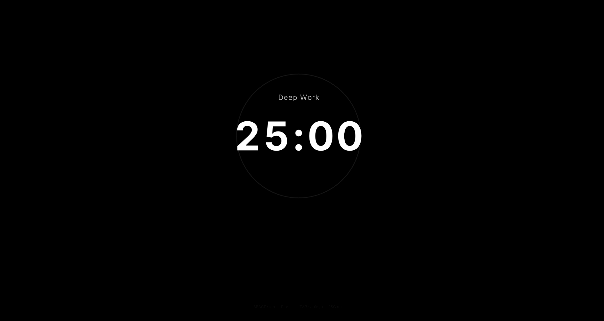
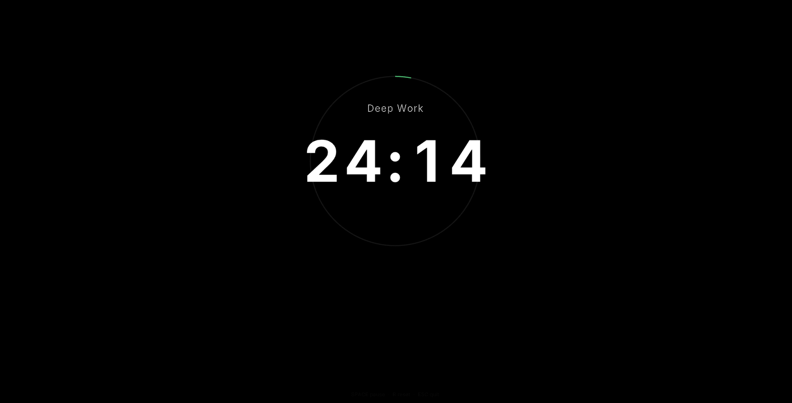
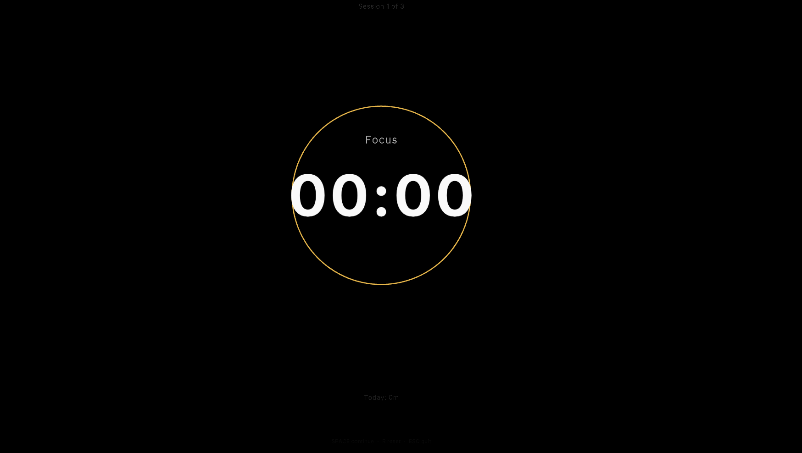
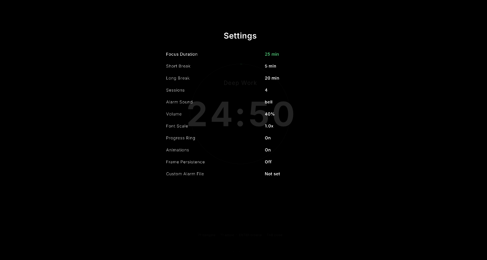

<p align="center">
  
</p>

<h1 align="center">PACE</h1>

<p align="center">
  A minimal, fullscreen productivity timer built for deep focus.
</p>

<p align="center">
  
  
  
  
  
</p>

---

**Download for Windows:** [Releases](https://github.com/VectorBlue-06/PACE-a-timer-app/releases)

> Currently only Windows is supported. macOS and Linux coming soon!

---

## Features

- **Single executable** — ~5 MB, no dependencies
- **Fullscreen** — Borderless window for deep focus
- **Two modes** — Countdown timer and Pomodoro
- **Customizable** — Remap keys and load your own alarm sound
- **Smooth UI** — 60 FPS animations and settings panel

---

## Screenshots

<p align="center">
  
  
</p>

<p align="center">
  
  
</p>

---

## Installation

### Prerequisites

- [Go](https://go.dev/dl/) 1.21 or later
- [GCC](https://www.mingw-w64.org/) (MinGW-w64 on Windows)

### Build

```bash
# PowerShell
.\build.ps1

# Command Prompt
build.bat

# Manual
set CGO_ENABLED=1
set GOARCH=amd64
go build -ldflags "-s -w -H windowsgui -extldflags '-static'" -o pace.exe .
```

**Output:** `pace.exe` (~5 MB, fully self-contained)

---

## How to Use

1. Download and run `pace.exe`
2. Press **Space** to start the timer
3. Press **1**, **2**, or **3** to switch between presets (25 min, 50 min, 5 min break)
4. Press **P** for Pomodoro mode (focus → break → focus cycle)
5. Press **TAB** to open settings and customize durations, sounds, and keybinds
6. Press **F** to toggle fullscreen, **ESC** to exit

> NOTE - Controls may change in future for the ease of use.

---

## Usage

Run `PACE.exe`. The timer launches in fullscreen.

### Keyboard Shortcuts

| Key           | Action                          |
|---------------|---------------------------------|
| Space         | Start / Pause / Resume          |
| R             | Reset timer                     |
| F             | Toggle fullscreen               |
| TAB           | Open / close settings panel     |
| Ctrl+Space    | Toggle frame persistence mode   |
| P             | Pomodoro mode                   |
| S             | Sound selector                  |
| 1             | 25 minute timer                 |
| 2             | 50 minute timer                 |
| 3             | 5 minute break                  |
| ESC           | Exit                            |

### Settings Panel (TAB)

| Key   | Action            |
|-------|-------------------|
| ↑ ↓   | Navigate options  |
| ← →   | Adjust values     |
| ENTER | Browse alarm file |
| TAB   | Close settings    |

---

## Project Structure

```
do-it/
├── assets/
│   ├── fonts/              # Inter TTF files (embedded at compile time)
│   ├── sounds/             # WAV sound files (embedded at compile time)
│   ├── PACE-banner.png
│   └── PACE-logo.png
├── main.go                 # Window init and render loop
├── app.go                  # Central state machine and lifecycle
├── timer.go                # System-clock timer with digit transitions
├── pomodoro.go             # Pomodoro cycle state machine
├── renderer.go             # Layered rendering via Raylib
├── input.go                # Configurable keyboard event routing
├── sound.go                # Embedded sound loading and playback
├── fonts.go                # Embedded TTF loading via go:embed
├── ui.go                   # Animation engine (blink, scale, fade)
├── config.go               # JSON configuration with key bindings
├── dialog_windows.go       # Windows file picker for custom alarm
├── build.ps1               # PowerShell build script
├── build.bat               # Command Prompt build script
├── config.json             # Auto-generated user config
└── docs/
    └── DOCUMENTATION.md    # Full technical documentation
```

---

## Documentation

See [docs/DOCUMENTATION.md](DOCUMENTATION.md) for the full technical reference — architecture, rendering pipeline, animation system, configuration schema, and more.

---

## License

This project is provided as-is for personal use.
