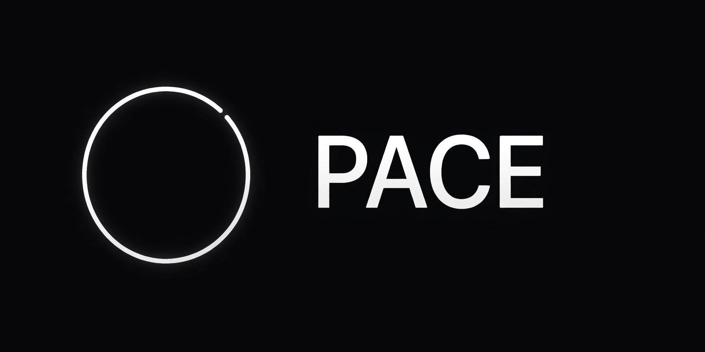

<p align="center">
  
</p>

<h1 align="center">PACE</h1>

<p align="center">
  A minimal, fullscreen productivity timer built for deep focus.
</p>

<p align="center">
  
  
  
  
  
</p>

---

## Features

- **Single executable** — ~5 MB static binary, no DLLs, no runtime dependencies
- **Fullscreen by default** — Borderless window that fills the screen
- **Two timer modes** — Countdown and Pomodoro
- **Pomodoro cycle** — Configurable focus/break/long break with session tracking
- **UI feedback sounds** — Subtle start, pause, resume, and reset audio cues
- **Custom alarm sound** — Load your own WAV/MP3 for the timer completion alert
- **Smooth animations** — Scale, fade, and blink at 60 FPS
- **Settings panel** — In-app overlay (TAB) to adjust all options live
- **Configurable keys** — Every shortcut is remappable via `config.json`
- **Embedded sounds** — Bell, chime, and UI sounds compiled into the binary
- **Embedded fonts** — Inter typeface (Regular, SemiBold, Bold) compiled into the binary
- **Frame persistence** — Optional motion-trail rendering mode (Ctrl+Space)
- **Progress ring** — Thin circular arc that tracks elapsed time
- **Auto-saved config** — Settings persist across sessions via JSON

---

## Installation

### Prerequisites

- [Go](https://go.dev/dl/) 1.21 or later
- [GCC](https://www.mingw-w64.org/) (MinGW-w64 on Windows)

### Build

```bash
# PowerShell
.\build.ps1

# Command Prompt
build.bat

# Manual
set CGO_ENABLED=1
set GOARCH=amd64
go build -ldflags "-s -w -H windowsgui -extldflags '-static'" -o pace.exe .
```

**Output:** `pace.exe` (~5 MB, fully self-contained)

---

## Usage

Run `pace.exe`. The timer launches in fullscreen.

### Keyboard Shortcuts

| Key           | Action                          |
|---------------|---------------------------------|
| Space         | Start / Pause / Resume          |
| R             | Reset timer                     |
| F             | Toggle fullscreen               |
| TAB           | Open / close settings panel     |
| Ctrl+Space    | Toggle frame persistence mode   |
| P             | Pomodoro mode                   |
| S             | Sound selector                  |
| 1             | 25 minute timer                 |
| 2             | 50 minute timer                 |
| 3             | 5 minute break                  |
| ESC           | Exit                            |

### Settings Panel (TAB)

| Key   | Action            |
|-------|-------------------|
| ↑ ↓   | Navigate options  |
| ← →   | Adjust values     |
| ENTER | Browse alarm file |
| TAB   | Close settings    |

---

## Screenshots

> _Screenshots coming soon._

---

## Project Structure

```
do-it/
├── assets/
│   ├── fonts/              # Inter TTF files (embedded at compile time)
│   ├── sounds/             # WAV sound files (embedded at compile time)
│   ├── PACE-banner.png
│   └── PACE-logo.png
├── main.go                 # Window init and render loop
├── app.go                  # Central state machine and lifecycle
├── timer.go                # System-clock timer with digit transitions
├── pomodoro.go             # Pomodoro cycle state machine
├── renderer.go             # Layered rendering via Raylib
├── input.go                # Configurable keyboard event routing
├── sound.go                # Embedded sound loading and playback
├── fonts.go                # Embedded TTF loading via go:embed
├── ui.go                   # Animation engine (blink, scale, fade)
├── config.go               # JSON configuration with key bindings
├── dialog_windows.go       # Windows file picker for custom alarm
├── build.ps1               # PowerShell build script
├── build.bat               # Command Prompt build script
├── config.json             # Auto-generated user config
└── docs/
    └── DOCUMENTATION.md    # Full technical documentation
```

---

## Documentation

See [docs/DOCUMENTATION.md](DOCUMENTATION.md) for the full technical reference — architecture, rendering pipeline, animation system, configuration schema, and more.

---

## License

This project is provided as-is for personal use.
